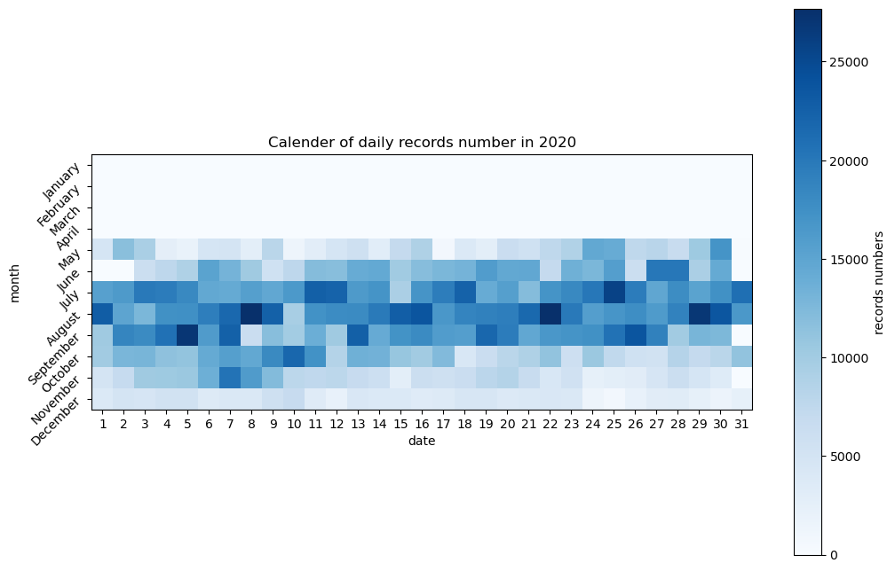
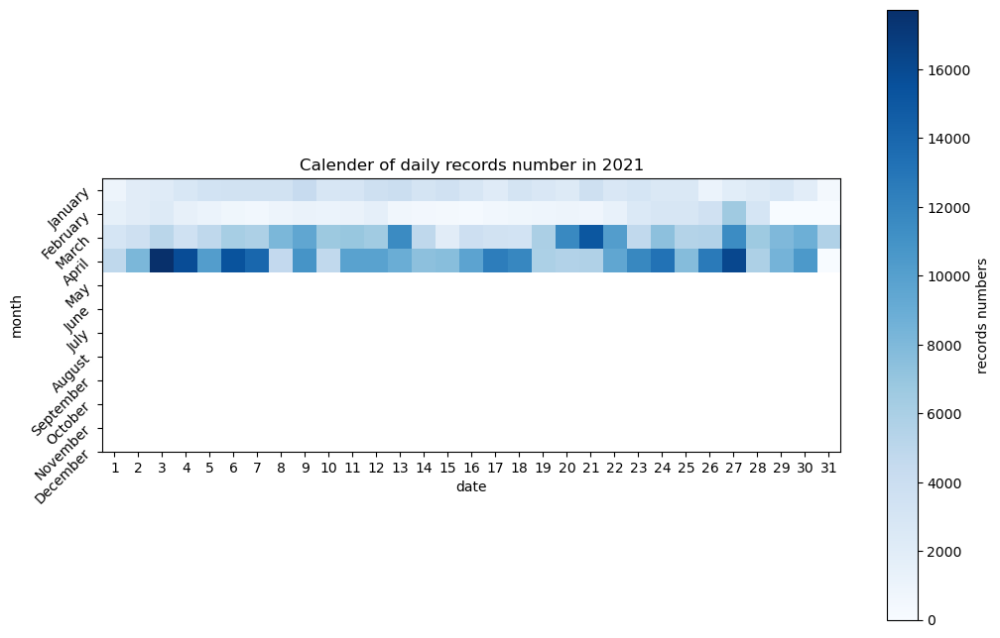

# 数据预处理

==处理完的数据存储在`new_data.csv`==

## 信息
### 描述信息(来自网站)
 1. 数据为2020年5月-2021年5月的数据
 2. 总共有5800辆车，总共有600个停车桩
### 数据清洗（kaggle上的v2.csv版本就是已处理的）
  1. 骑行时长不到一分钟的记为无效记录（kaggle）
  2. 骑行结束时间小于开始时间的为无效记录（kaggle）
  3. 只保留了骑行开始和结束时间在同一天的数据
### 数据信息（来自文件，并未使用这些信息）
 1. 总共有3498686条数据
 2. 不同的station在710个
 3. 有不同类型的用户member和casual
 4. 有不同类型的车子docked_bike、electric_bike、classic_bike
## 目标
 1. 估算合理的早晚划分
 2. 根据前一晚的supply保留第二天的demand
 3. 划分格子点

## 结果

### 数据分布

2020年的数据分布



2021年的数据分布



最后选择了记录数量较多且差异较大的2020年9月。


### 选取早晚划分时间

由于工作日和周末的数据分布非常不同，分开来进行。

| 日期属性 | 星期（早上） | 早上时间段   | 前一晚的时间段 |
| -------- | ------------ | ------------ | -------------- |
| 工作日   | 1~5          | 7：00-9：59  | 19：00-23：59  |
| 周末     | 6、7         | 7：00-10：59 | 20：00-23：59  |

并新增列`label_day`（"weekday" 或者 "weekend"）和`label_time`（"morning" 或 "evening"）

此步结束后的数据存储在`filtered.csv`


### 保留一定数量的需求

遍历日期，对于每一天，统计当日早上的需求量和前一晚的供给量

每日的供给量和需求如下：

```py
day supply demand
2 1879 2299
3 3951 2103
4 3903 1953
5 2789 2890
6 2955 348
7 3628 1280
8 2494 479
9 1092 1554
10 2106 1878
11 919 1306
12 2153 831
13 1760 2434
14 2649 1862
15 2334 1990
16 3279 2187
17 3691 2079
18 3070 1828
19 1710 2429
20 2019 2206
21 2257 1873
22 2391 2007
23 3200 2136
24 3201 2057
25 3378 2008
26 2969 2875
27 2790 2314
28 1807 1215
29 1668 1813
30 1925 1763
```

如果供给量<=需求量，则优先满足时间在前的需求

最终保证需求量<=供给量

此步结束后的数据存储在`data_20_9.csv`

### 划分格点

将lng（经度）作为x轴，lat（纬度）作为y轴，统计数据中经纬度范围

x轴对应的经度范围：-87.77 ~ -87.53，对应格子点：0, 1, ..., 24

y轴对应的纬度范围：41.65 ~ 42.06，对应格子点：0, 1, ..., 41

并新增列`x`和`y`

此步结束后的数据存储在`new_data.csv`